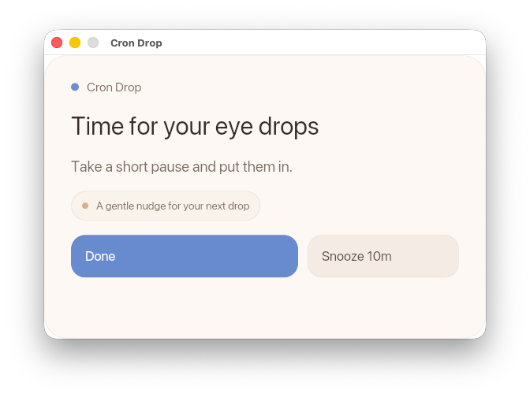

# Cron Drop

<p align="center">
  
</p>

<p align="center"><strong>Desktop eye-drop reminders that stay out of your way until you need them.</strong></p>

Cron Drop is a desktop reminder app for people who want reliable eye-drop reminders without keeping a phone app open all day. You set a schedule once, Cron Drop runs quietly in the background, and a native popup appears when it is time to use your drops.

It is built around a simple idea: reminders should be dependable, visible, and easy to control.

## Why People Use It

- Native popup reminders instead of easy-to-miss background notifications
- Repeating schedules or fixed reminder times
- Tray access for quick status and control
- Pause-for-today support when your routine changes
- Launch-at-login support so it stays running

## Install

Homebrew is the easiest way to install Cron Drop:

```bash
brew tap AlTosterino/crondrop
brew install crondrop
```

Then confirm the CLI is available:

```bash
crondrop --help
```

## Quick Start

Initialize Cron Drop once:

```bash
crondrop init
```

Set a repeating schedule every hour between 08:00 and 22:00:

```bash
crondrop schedule every 1h --from 08:00 --to 22:00
```

Or use fixed reminder times:

```bash
crondrop schedule add --at 09:00 --at 13:00 --at 18:00
```

By default, setting a schedule also starts Cron Drop in the background.

## Everyday Commands

Check status:

```bash
crondrop status
```

Pause reminders for the rest of today:

```bash
crondrop pause --today
```

Resume reminders:

```bash
crondrop resume
```

Preview the reminder popup:

```bash
crondrop preview
```

## More Docs

- User and CLI guide: [`docs/user-guide.md`](./docs/user-guide.md)
- Development and local setup: [`docs/development.md`](./docs/development.md)
- Packaging and release notes: [`packaging/README.md`](./packaging/README.md)
- Homebrew maintainer notes: [`packaging/homebrew-tap/README.md`](./packaging/homebrew-tap/README.md)

## Status

Cron Drop is usable today as a CLI-first desktop reminder tool. The project is still evolving, but the core workflow is already simple: install it, set a schedule, and let it remind you when it matters.
